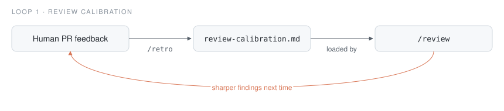
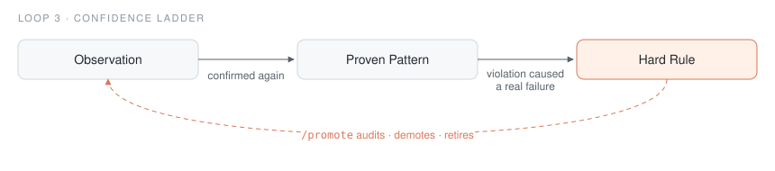

<p align="center"></p>

# claude-feedback-loops

**Your pipeline tells you where it leaks. This plugin makes you write it down.**

[](LICENSE)
[](https://docs.anthropic.com/en/docs/claude-code)


Every time a later stage catches something an earlier one should have — review finds what tests missed, CI fails on what passed locally, a human spots what the bot didn't — that is a **pipeline gap**. Everyone experiences them; almost nobody logs them. This plugin does: `/ship` writes one line per gap, and `/gaps` periodically clusters the log by root cause and closes each cluster at the cheapest layer that can hold it.


It ships with two smaller loops that share the same shape (log the signal, then act on it in bulk): review calibration from human PR feedback, and a confidence ladder for lessons. **Five slash commands. Three markdown files. No runtime, no database.** Works alongside whatever memory setup you already have.

## What six months of gap logging looks like

From the author's own logs — 19 gaps across four projects, February to August 2026:

| Should have caught it | Actually caught it | Gaps |
|---|---|---|
| local `/review` | bot review, after push | 6 |
| tests | local `/review` | 4 |
| local `/review` | human reviewer | 2 |
| the pipeline tooling itself broke (wrong lint flags, missing venv, a hook misreading the branch) | — | 5 |
| other | | 2 |

Two clusters turned into concrete pipeline changes:

- **6 of 19 were review misses the bot caught anyway** — so the pipeline was reordered to open the PR *before* the local review. CI and the bot now run while the diff is being read, and local and remote findings get fixed in one pass instead of two.
- **3 were "reviewed the changed files, not their callers"** (a changed return type, stale test mocks, a third call site of a threaded flag) — so "grep every use of a changed signature" became an explicit review step.

None of that would have happened from memory alone. Individually each gap is a shrug; the log is what makes the pattern visible.

## Example: one retro

Real run on [statsmodels PR #10223](https://github.com/statsmodels/statsmodels/pull/10223), where the maintainer asked for a new `ps_bounds` kwarg to be `array_like` with validation instead of a raw tuple. `/retro 10223` produced:

> **PR #10223 (merged)** — one human reviewer (bashtage), one substantive comment, no bugs or edge cases caught.
>
> - **Convention**: `ps_bounds` was documented as `tuple of float` and stored raw. Reviewer required `array_like of float` + `array_like(...)` validation, plus an explicit range check. Fixed in `21f9af8`.
> - No design, bug, or edge-case findings; approved after the one round.

and appended this to `.claude/review-calibration.md`:

```markdown
## Conventions
- A new public sequence-valued parameter (bounds, weights, ranges) must be typed
  `array_like of float` in the docstring, not `tuple of float`, and converted/validated
  at `__init__` with `statsmodels.tools.validation.array_like(value, "name", shape=(n,))`
  — then add an explicit check for what array_like cannot express (value ranges, ordering).
  Flag any new user-facing sequence kwarg stored raw via `self.x = x` — learned from PR #10223
```

One human comment became a check that runs on every future review of that codebase. Output trimmed only for length.

## Try it in five minutes

1. Install:

   ```
   /plugin marketplace add kirilklein/claude-feedback-loops
   /plugin install feedback-loops@claude-feedback-loops
   ```

2. In any repo with uncommitted changes, run `/review`. No calibration file yet, so nothing is tagged. That is the baseline.

3. Pick a past PR where a human left comments and run `/retro <number>`. Then `cat .claude/review-calibration.md`. From now on `/review` loads it and tags findings it produces with `[calibrated]`.

## Commands

| Command | What it does | Run it when |
|---|---|---|
| `/ship` | format → lint → test → review → commit → push, logging every case where a later step catches an earlier step's miss. Reads format/lint/test commands from your `CLAUDE.md`, else infers them from project files | To ship a change |
| `/gaps` | Clusters the gap log by root cause; closes each at the cheapest layer (lint config > test mapping > calibration > lesson) | Every week or two |
| `/retro` | Reads human PR comments, asks *"could `/review` have caught this?"*, writes each miss as a concrete calibration pattern | After humans review your PR |
| `/review` | Focused code review that loads your calibration patterns and tags their findings `[calibrated]` | Before pushing, or on demand |
| `/promote` | Audits `lessons.md`: promotes entries with fresh evidence, demotes contradicted ones, retires entries about deleted code | When lessons feel stale |

## The loops in detail

### 1. Pipeline gap tracking — `/ship` → `/gaps`

`/ship`'s real job isn't running the pipeline — it's noticing when a **later step catches what an earlier one should have** (review flagging what lint missed, CI failing on what tests passed) and logging one line per gap:

```markdown
- [2026-03-12] step 6 (review) missed broken caller: changed return type to tuple but only reviewed changed files, not callers — caught by bot review
```

`/gaps` then clusters the log by root cause and closes each cluster at the cheapest layer: a lint config change closes a gap *mechanically*; a calibration entry closes it *probabilistically*; a lesson closes it only if it's remembered. The pipeline tightens itself.

### 2. Review calibration — `/retro` → `/review`



After humans review your PR, `/retro` reads their comments and distills each miss into a pattern specific enough to act on:

```markdown
## Bugs
- Watch for off-by-one at pagination boundaries when page_size divides the total — learned from PR #17
```

`/review` loads these every run and tags the findings they produce with `[calibrated]`, so you can watch the loop pay for itself. Your reviews get sharper with every PR that gets human eyes.

### 3. The confidence ladder — `lessons.md` → `/promote`



The problem with accumulated lessons is they're all treated equally — a hunch from March sits next to a rule that prevented a production bug. The ladder fixes that:

| Level | Meaning | How an entry gets here |
|---|---|---|
| **Hard Rules** | Mandatory | A violation caused a real failure |
| **Proven Patterns** | Default to following | Confirmed 2+ times |
| **Observations** | Context, not gospel | Noticed once |

`/promote` moves entries up only with evidence it can point to, demotes ones the code has moved past, and retires ones about deleted code. Your lessons file stays small and trustworthy instead of growing into a second codebase.

## Files it maintains

Per project, in `.claude/` — all plain markdown, checked into git, shared with your team:

| File | Written by | Read by |
|---|---|---|
| `review-calibration.md` | `/retro` | `/review` |
| `workflow-gaps.md` | `/ship` | `/gaps` |
| `lessons.md` | `/retro`, you | `/review`, `/promote` |

Templates in [`templates/`](templates/).

## What this is not

- **Not a memory system** — pair it with one; it calibrates what memory captures.
- **Not a framework** — five prompts and three markdown files you can read in ten minutes.
- **Not magic** — the loops only close if you run `/gaps` every week or two and `/retro` after human reviews. That's the whole discipline.

## Origins

Distilled from [self-improving-claude](https://github.com/kirilklein/self-improving-claude), a full working `~/.claude/` configuration. This repo keeps only the ideas that memory plugins haven't since absorbed, repackaged as an installable plugin.

## Contributing

See [CONTRIBUTING.md](CONTRIBUTING.md). The most useful contribution is a calibration pattern that caught something real: there is an [issue template](.github/ISSUE_TEMPLATE/calibration-pattern.md) for it.

## License

[MIT](LICENSE)
