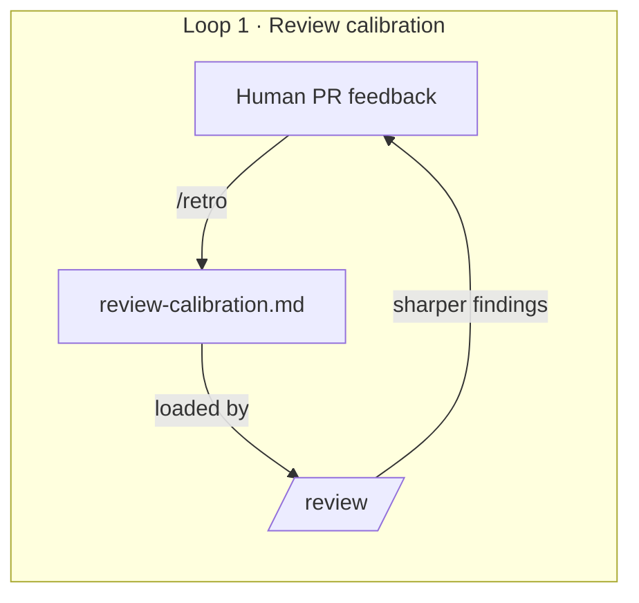
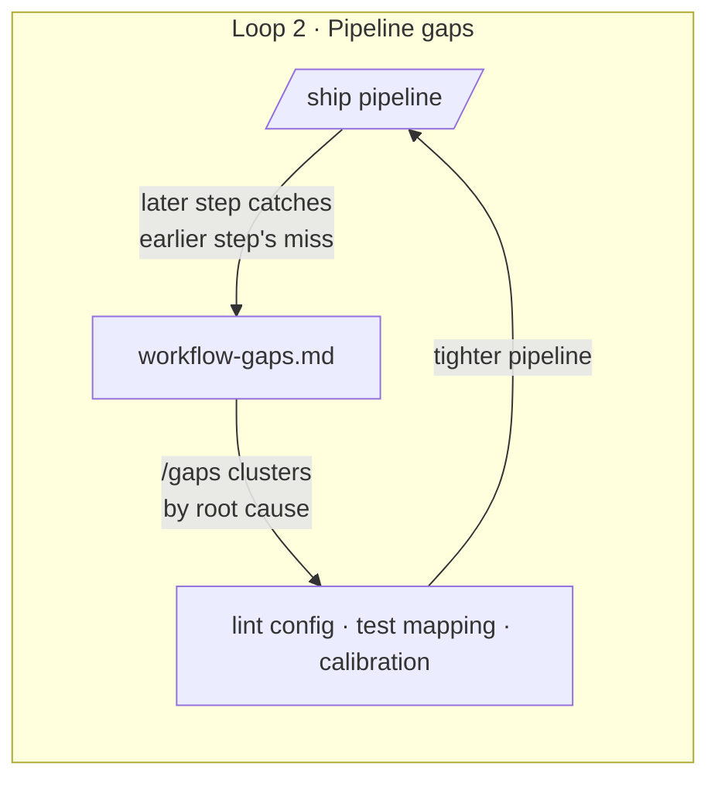
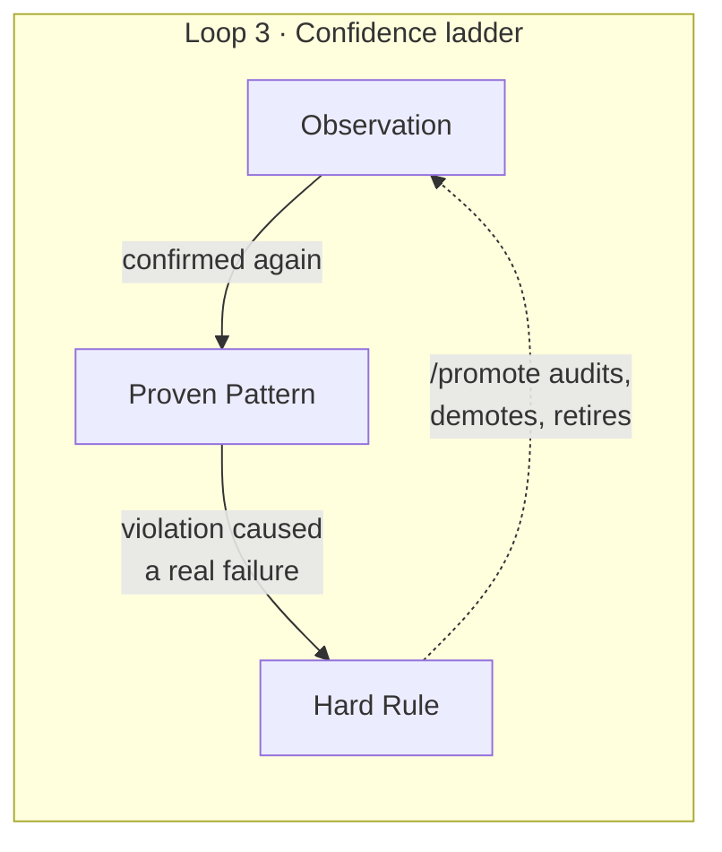

# claude-feedback-loops

**Feedback loops your memory plugin doesn't close.**

[](LICENSE)
[](https://docs.anthropic.com/en/docs/claude-code)


Memory tools (claude-mem, Claude Code's native memory) are great at *capturing* what happened. They hoard; they don't calibrate. This plugin adds the missing half: three small loops that turn what happened into behavior that actually changes.

**Five slash commands. Three markdown files. No runtime, no database.** Works alongside whatever memory setup you already have.







## Install

```
/plugin marketplace add kirilklein/claude-feedback-loops
/plugin install feedback-loops@claude-feedback-loops
```

## Commands

| Command | What it does | Run it when |
|---|---|---|
| `/retro` | Reads human PR comments, asks *"could `/review` have caught this?"*, writes each miss as a concrete calibration pattern | After humans review your PR |
| `/review` | Focused code review that loads your calibration patterns and tags their findings `[calibrated]` | Before pushing, or on demand |
| `/ship` | format → lint → test → review → commit → push, logging every case where a later step catches an earlier step's miss | To ship a change |
| `/gaps` | Clusters the gap log by root cause; closes each at the cheapest layer (lint config > test mapping > calibration > lesson) | Every week or two |
| `/promote` | Audits `lessons.md`: promotes entries with fresh evidence, demotes contradicted ones, retires entries about deleted code | When lessons feel stale |

## The loops in detail

### 1. Review calibration — `/retro` → `/review`

After humans review your PR, `/retro` reads their comments and distills each miss into a pattern specific enough to act on:

```markdown
## Bugs
- Watch for off-by-one at pagination boundaries when page_size divides the total — learned from PR #17
```

`/review` loads these every run and tags the findings they produce with `[calibrated]`, so you can watch the loop pay for itself. Your reviews get sharper with every PR that gets human eyes.

### 2. Pipeline gap tracking — `/ship` → `/gaps`

`/ship`'s real job isn't running the pipeline — it's noticing when a **later step catches what an earlier one should have** (review flagging what lint missed, CI failing on what tests passed) and logging one line per gap.

`/gaps` then clusters the log by root cause and closes each cluster at the cheapest layer: a lint config change closes a gap *mechanically*; a calibration entry closes it *probabilistically*; a lesson closes it only if it's remembered. The pipeline tightens itself.

### 3. The confidence ladder — `lessons.md` → `/promote`

The problem with accumulated lessons is they're all treated equally — a hunch from March sits next to a rule that prevented a production bug. The ladder fixes that:

| Level | Meaning | How an entry gets here |
|---|---|---|
| **Hard Rules** | Mandatory | A violation caused a real failure |
| **Proven Patterns** | Default to following | Confirmed 2+ times |
| **Observations** | Context, not gospel | Noticed once |

`/promote` moves entries up only with evidence it can point to, demotes ones the code has moved past, and retires ones about deleted code. Your lessons file stays small and trustworthy instead of growing into a second codebase.

## Files it maintains

Per project, in `.claude/` — all plain markdown, checked into git, shared with your team:

| File | Written by | Read by |
|---|---|---|
| `review-calibration.md` | `/retro` | `/review` |
| `workflow-gaps.md` | `/ship` | `/gaps` |
| `lessons.md` | `/retro`, you | `/review`, `/promote` |

Templates in [`templates/`](templates/).

## What this is not

- **Not a memory system** — pair it with one; it calibrates what memory captures.
- **Not a framework** — five prompts and three markdown files you can read in ten minutes.
- **Not magic** — the loops only close if you run `/retro` after human reviews and `/gaps` occasionally. That's the whole discipline.

## Origins

Distilled from [self-improving-claude](https://github.com/kirilklein/self-improving-claude), a full working `~/.claude/` configuration. This repo keeps only the ideas that memory plugins haven't since absorbed, repackaged as an installable plugin.

## License

[MIT](LICENSE)
